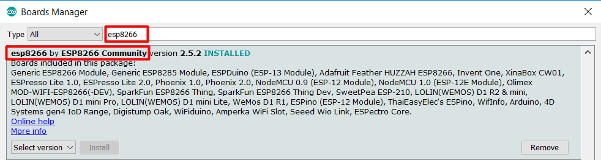

# Sending messages to Telegram Bot from ESP8266.

* **Simple**. All you need is: Enter wi-fi password, ssid, bot token and recipients.

# How to use?

1. Set token of your bot and recipients in init method, set ssid and password of Wi-Fi in ESP8266_TelegramBot.ino.
2. Connect wires as shown on the picture.

3. Download Arduino IDE.
4. File->Preferences->Enter to Additional Boards Manager URLs: "http://arduino.esp8266.com/stable/package_esp8266com_index.json"

5. Open Boards Manager.
6.Search and install esp8266 by ESP8266 Community:

7. Connect Arduino to USB, wait for 10 seconds.
8. Put out GPIO0 wire from GND.
9. Ready.
